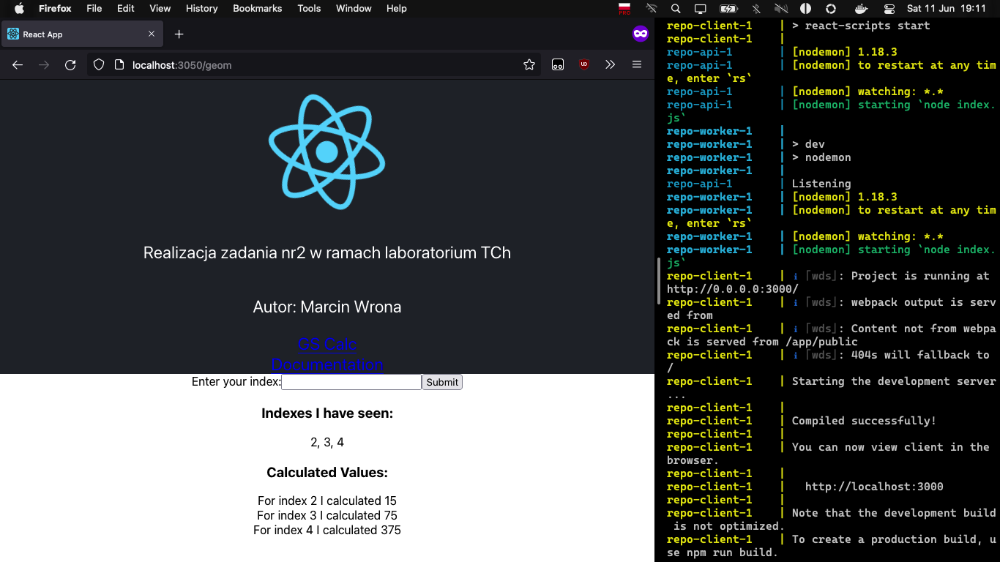

# README - wersja rozwojowa

## Budowa obrazów

Aby zbudować obrazy, należy wykorzystać narzędzie docker-compose z plikiem wersji rozwojowej - `docker-compose.dev.yml`:
```sh
[repo]:% docker compose -f docker-compose.dev.yml build
[+] Building 2.6s (32/32) FINISHED
 => [repo_client internal] load build definition from Dockerfile.dev                           0.0s
 => => transferring dockerfile: 193B                                                           0.0s
 => [repo_nginx internal] load build definition from Dockerfile.dev                            0.1s
 => => transferring dockerfile: 103B                                                           0.0s
 => [repo_worker internal] load build definition from Dockerfile.dev                           0.0s
 => => transferring dockerfile: 191B                                                           0.0s
 => [repo_api internal] load build definition from Dockerfile.dev                              0.0s
 => => transferring dockerfile: 154B                                                           0.0s
 => [repo_client internal] load .dockerignore                                                  0.0s
 => => transferring context: 2B                                                                0.0s
 => [repo_nginx internal] load .dockerignore                                                   0.0s
 => => transferring context: 2B                                                                0.0s
 => [repo_worker internal] load .dockerignore                                                  0.0s
 => => transferring context: 2B                                                                0.0s
 => [repo_api internal] load .dockerignore                                                     0.0s
 => => transferring context: 2B                                                                0.0s
 => [repo_client internal] load metadata for docker.io/library/node:alpine                     1.7s
 => [repo_nginx internal] load metadata for docker.io/library/nginx:latest                     0.0s
 => [repo_nginx internal] load build context                                                   0.0s
 => => transferring context: 34B                                                               0.0s
 => [repo_nginx 1/2] FROM docker.io/library/nginx                                              0.0s
 => CACHED [repo_nginx 2/2] COPY ./default.conf /etc/nginx/conf.d/default.conf                 0.0s
 => [repo_client] exporting to image                                                           0.2s
 => => exporting layers                                                                        0.1s
 => => writing image sha256:c13dfc9f4d95bee581f222f674e92bb130e43c6c88b234a5e44ba857a326c7fd   0.0s
 => => naming to docker.io/library/repo_nginx                                                  0.0s
 => => writing image sha256:25615fc31eac3b12dc5b7a9bdb17d0ecb63ec734fafde3dd1fe38c1761ea50ae   0.0s
 => => naming to docker.io/library/repo_worker                                                 0.0s
 => => writing image sha256:14e03d390bb159b136aee52147806155cf69b657b02f7aaeb935e121d53cd352   0.0s
 => => naming to docker.io/library/repo_api                                                    0.0s
 => => writing image sha256:4afa8a4150385c85a0e5d847ac9cd4eade18467d6f058fceadeb61a0bb234c68   0.0s
 => => naming to docker.io/library/repo_client                                                 0.0s
 => [repo_api internal] load metadata for docker.io/library/node:14.14.0-alpine                1.4s
 => [auth] library/node:pull token for registry-1.docker.io                                    0.0s
 => [repo_worker 1/5] FROM docker.io/library/node:alpine@sha256:57b98f182ea7253f213f742f1f7ba  0.0s
 => [repo_worker internal] load build context                                                  0.0s
 => => transferring context: 184B                                                              0.0s
 => [repo_client internal] load build context                                                  0.0s
 => => transferring context: 930B                                                              0.0s
 => [repo_api 1/5] FROM docker.io/library/node:14.14.0-alpine@sha256:97c4cddbbf97299f5eda0994  0.0s
 => [repo_api internal] load build context                                                     0.0s
 => => transferring context: 183B                                                              0.0s
 => CACHED [repo_client 2/5] WORKDIR /app                                                      0.0s
 => CACHED [repo_worker 3/5] COPY ./package.json ./                                            0.0s
 => CACHED [repo_worker 4/5] RUN npm install                                                   0.0s
 => CACHED [repo_worker 5/5] COPY . .                                                          0.0s
 => CACHED [repo_client 3/5] COPY ./package.json ./                                            0.0s
 => CACHED [repo_client 4/5] RUN npm install                                                   0.0s
 => CACHED [repo_client 5/5] COPY . .                                                          0.0s
 => CACHED [repo_api 2/5] WORKDIR /app                                                         0.0s
 => CACHED [repo_api 3/5] COPY ./package.json ./                                               0.0s
 => CACHED [repo_api 4/5] RUN npm install                                                      0.0s
 => CACHED [repo_api 5/5] COPY . .                                                             0.0s

Use 'docker scan' to run Snyk tests against images to find vulnerabilities and learn how to fix them
[repo]:%
```

## Uruchomienie usługi

Aby uruchomić usługę w wersji rozwojowej:
```sh
[repo]:% docker compose -f docker-compose.dev.yml up
[+] Running 6/6
 ⠿ Container repo-api-1       Created                                                          0.0s
 ⠿ Container repo-redis-1     Created                                                          0.0s
 ⠿ Container repo-postgres-1  Created                                                          0.0s
 ⠿ Container repo-worker-1    Created                                                          0.0s
 ⠿ Container repo-client-1    Recreated                                                        0.3s
 ⠿ Container repo-nginx-1     Recreated                                                        0.4s
Attaching to repo-api-1, repo-client-1, repo-nginx-1, repo-postgres-1, repo-redis-1, repo-worker-1
[...]
```

## Dowód działania usługi



W wersji rozwojowej kontener `client` korzysta z serwera rozwojowego `webpack`, co jest widoczne w log'ach.
