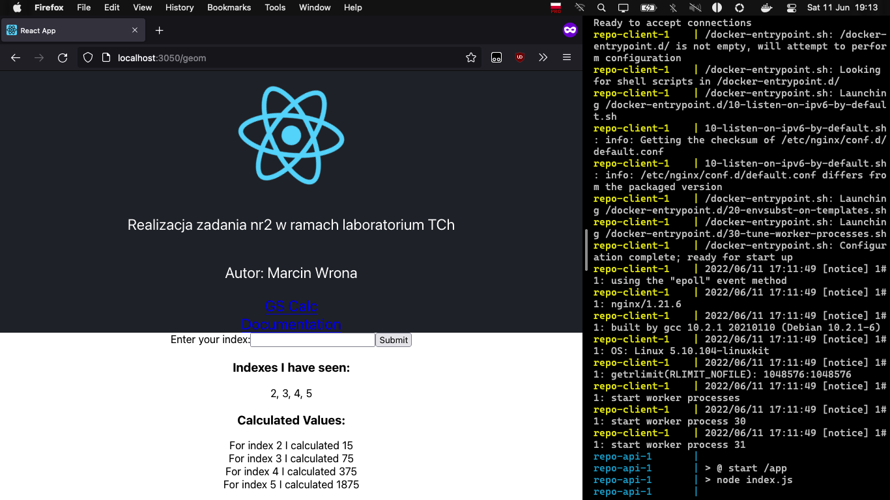

# README - wersja produkcyjna

## Konfiguracja repozytorium

Aby skorzystać z repozytorium obrazów, należy najpierw skonfigurować repozytorium za pomocą zmiennych środowiskowych (np. plik `.env` w katalogu głównym projektu). Obrazy przygotowane w ramach rozwiązania zadania znajdują się na [tym repozytorium Docker Hub](https://hub.docker.com/repository/docker/marcinwrona1/technologie_chmurowe_zad2). Aby z nich skorzystać należy wykorzystać następującą konfigurację:
```sh
TCH2_REGISTRY_ADDR='docker.io'
TCH2_REGISTRY_USER='marcinwrona1'
TCH2_IMAGE_NGINX='technologie_chmurowe_zad2:nginx'
TCH2_IMAGE_API='technologie_chmurowe_zad2:api'
TCH2_IMAGE_CLIENT='technologie_chmurowe_zad2:client'
TCH2_IMAGE_WORKER='technologie_chmurowe_zad2:worker'
```

## Budowa obrazów

Aby zbudować obrazy, należy wykorzystać narzędzie docker-compose z plikiem wersji produkcyjnej - `docker-compose.yml`:
```sh
[repo]:% docker compose build
[+] Building 2.6s (35/35) FINISHED
 => [docker.io/marcinwrona1/technologie_chmurowe_zad2:nginx internal] load build definition f  0.0s
 => => transferring dockerfile: 98B                                                            0.0s
 => [docker.io/marcinwrona1/technologie_chmurowe_zad2:api internal] load build definition fro  0.0s
 => => transferring dockerfile: 152B                                                           0.0s
 => [docker.io/marcinwrona1/technologie_chmurowe_zad2:client internal] load build definition   0.0s
 => => transferring dockerfile: 324B                                                           0.0s
 => [docker.io/marcinwrona1/technologie_chmurowe_zad2:worker internal] load build definition   0.0s
 => => transferring dockerfile: 189B                                                           0.0s
 => [docker.io/marcinwrona1/technologie_chmurowe_zad2:nginx internal] load .dockerignore       0.0s
 => => transferring context: 2B                                                                0.0s
 => [docker.io/marcinwrona1/technologie_chmurowe_zad2:api internal] load .dockerignore         0.0s
 => => transferring context: 2B                                                                0.0s
 => [docker.io/marcinwrona1/technologie_chmurowe_zad2:client internal] load .dockerignore      0.0s
 => => transferring context: 2B                                                                0.0s
 => [docker.io/marcinwrona1/technologie_chmurowe_zad2:worker internal] load .dockerignore      0.0s
 => => transferring context: 2B                                                                0.0s
 => [docker.io/marcinwrona1/technologie_chmurowe_zad2:client internal] load metadata for dock  0.0s
 => [docker.io/marcinwrona1/technologie_chmurowe_zad2:nginx internal] load build context       0.0s
 => => transferring context: 34B                                                               0.0s
 => [docker.io/marcinwrona1/technologie_chmurowe_zad2:client stage-1 1/3] FROM docker.io/libr  0.0s
 => CACHED [docker.io/marcinwrona1/technologie_chmurowe_zad2:nginx 2/2] COPY ./default.conf /  0.0s
 => [docker.io/marcinwrona1/technologie_chmurowe_zad2:api] exporting to image                  0.1s
 => => exporting layers                                                                        0.0s
 => => writing image sha256:c13dfc9f4d95bee581f222f674e92bb130e43c6c88b234a5e44ba857a326c7fd   0.0s
 => => naming to docker.io/marcinwrona1/technologie_chmurowe_zad2:nginx                        0.0s
 => => writing image sha256:67a745013719ffde8ec936430ff6d4785b9757e10a1204d15aaddabbdcb99da4   0.0s
 => => writing image sha256:21a585041391e0f9b8f78c5df22c2e782fec11c00458b4d9a223196a2ecdefa3   0.0s
 => => naming to docker.io/marcinwrona1/technologie_chmurowe_zad2:worker                       0.0s
 => => naming to docker.io/marcinwrona1/technologie_chmurowe_zad2:client                       0.0s
 => => writing image sha256:f87448f0621590ecd80efeaa9d3b57cbe6d66b957e06e677454147e13cf55114   0.0s
 => => naming to docker.io/marcinwrona1/technologie_chmurowe_zad2:api                          0.0s
 => [docker.io/marcinwrona1/technologie_chmurowe_zad2:api internal] load metadata for docker.  1.7s
 => [docker.io/marcinwrona1/technologie_chmurowe_zad2:worker internal] load metadata for dock  1.7s
 => [auth] library/node:pull token for registry-1.docker.io                                    0.0s
 => [docker.io/marcinwrona1/technologie_chmurowe_zad2:api 1/5] FROM docker.io/library/node:14  0.0s
 => [docker.io/marcinwrona1/technologie_chmurowe_zad2:api internal] load build context         0.0s
 => => transferring context: 183B                                                              0.0s
 => [docker.io/marcinwrona1/technologie_chmurowe_zad2:client builder 1/6] FROM docker.io/libr  0.0s
 => [docker.io/marcinwrona1/technologie_chmurowe_zad2:worker internal] load build context      0.0s
 => => transferring context: 184B                                                              0.0s
 => [docker.io/marcinwrona1/technologie_chmurowe_zad2:client internal] load build context      0.0s
 => => transferring context: 930B                                                              0.0s
 => CACHED [docker.io/marcinwrona1/technologie_chmurowe_zad2:client stage-1 2/3] COPY ./nginx  0.0s
 => CACHED [docker.io/marcinwrona1/technologie_chmurowe_zad2:worker builder 2/6] WORKDIR /app  0.0s
 => CACHED [docker.io/marcinwrona1/technologie_chmurowe_zad2:client builder 3/6] COPY ./packa  0.0s
 => CACHED [docker.io/marcinwrona1/technologie_chmurowe_zad2:client builder 4/6] RUN npm inst  0.0s
 => CACHED [docker.io/marcinwrona1/technologie_chmurowe_zad2:client builder 5/6] COPY . .      0.0s
 => CACHED [docker.io/marcinwrona1/technologie_chmurowe_zad2:client builder 6/6] RUN npm run   0.0s
 => CACHED [docker.io/marcinwrona1/technologie_chmurowe_zad2:client stage-1 3/3] COPY --from=  0.0s
 => CACHED [docker.io/marcinwrona1/technologie_chmurowe_zad2:api 2/5] WORKDIR /app             0.0s
 => CACHED [docker.io/marcinwrona1/technologie_chmurowe_zad2:api 3/5] COPY ./package.json ./   0.0s
 => CACHED [docker.io/marcinwrona1/technologie_chmurowe_zad2:api 4/5] RUN npm install          0.0s
 => CACHED [docker.io/marcinwrona1/technologie_chmurowe_zad2:api 5/5] COPY . .                 0.0s
 => CACHED [docker.io/marcinwrona1/technologie_chmurowe_zad2:worker 3/5] COPY ./package.json   0.0s
 => CACHED [docker.io/marcinwrona1/technologie_chmurowe_zad2:worker 4/5] RUN npm install       0.0s
 => CACHED [docker.io/marcinwrona1/technologie_chmurowe_zad2:worker 5/5] COPY . .              0.0s

Use 'docker scan' to run Snyk tests against images to find vulnerabilities and learn how to fix them
[repo]:%
```

## Uruchomienie usługi

Aby uruchomić usługę w wersji produkcyjnej:
```sh
[repo]:% docker compose up
[+] Running 6/6
 ⠿ Container repo-redis-1     Created                                                          0.0s
 ⠿ Container repo-postgres-1  Created                                                          0.0s
 ⠿ Container repo-worker-1    Recreated                                                        0.6s
 ⠿ Container repo-api-1       Recreated                                                        0.5s
 ⠿ Container repo-client-1    Recreated                                                        0.5s
 ⠿ Container repo-nginx-1     Recreated                                                        0.3s
Attaching to repo-api-1, repo-client-1, repo-nginx-1, repo-postgres-1, repo-redis-1, repo-worker-1
[...]
```

## Dowód działania usługi



W wersji produkcyjnej kontener `client` korzysta z serwera `nginx`, co jest widoczne w log'ach.
