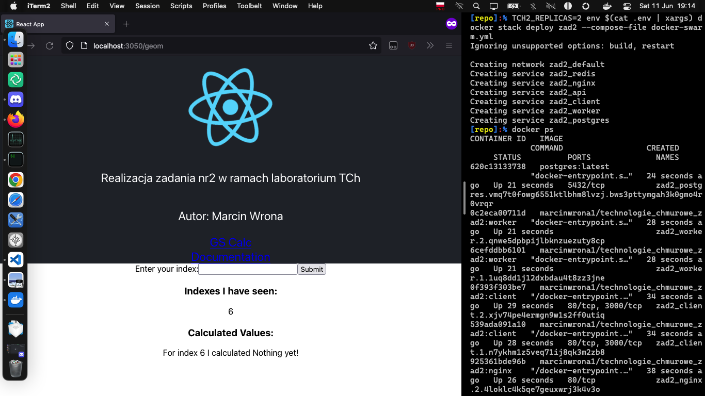

# README - wersja `stack` / `swarm`

## Konfiguracja repozytorium

Podobnie jak w przypadku [wersji produkcyjnej](./README_prod.md#konfiguracja-repozytorium), należy ustawić odpowiednie zmienne środowiskowe. Niestety, polecenie `docker stack` [nie wczytuje zmiennych środowiskowych z plików `.env`](https://docs.docker.com/compose/environment-variables/#substitute-environment-variables-in-compose-files). Należy więc wykorzystać funkcjonalność używanej powłoki (np. polecenie `export` w powłokach UNIX'owych lub `$ENV:[nazwa]` w PowerShell). Do wczytania konfiguracji z pliku, możemy wykorzystać polecenie `env` - aby ustawić dla całej bieżącej sesji powłoki:

```sh
$ export $(cat .env | xargs)
```

Lub, aby ustawić zmienne tylko dla danego wykonania polecenia `docker stack`:
```sh
$ env $(cat .env | xargs) docker stack [...]
```

Dodatkowo, wersja `stack` / `swarm` wymaga ustawienia zmiennej środowiskowej `TCH2_REPLICAS` - oznaczającą ilość replik każdego z poszczególnych kontenerów.

## Inicjalizacja klastra

```sh
[repo]:% docker swarm init
Swarm initialized: current node (fb68ubxixsmljjxx65bsu70go) is now a manager.

To add a worker to this swarm, run the following command:

    docker swarm join --token SWMTKN-1-4ezrd36chz75vs4dtwug8trpt1p5jvtsrylv1i9j0ttnf8jpwp-ddx97snk8wxpwwsruk2b4oz2z 192.168.65.3:2377

To add a manager to this swarm, run 'docker swarm join-token manager' and follow the instructions.

[repo]:%
```

## Uruchomienie usługi

Aby uruchomić usługę, należy wykorzystać narzędzie `docker stack` z plikiem wersji `stack` / `swarm` - `docker-swarm.yml`:

```sh
[repo]:% TCH2_REPLICAS=2 env $(cat .env | xargs) docker stack deploy zad2 --compose-file docker-swarm.yml
Ignoring unsupported options: build, restart

Creating network zad2_default
Creating service zad2_postgres
Creating service zad2_redis
Creating service zad2_nginx
Creating service zad2_api
Creating service zad2_client
Creating service zad2_worker
[repo]:%
```

## Przyjęte zasady konfiguracji w sekcji `deploy`

Ilość replik każdego z kontenerów jest ustawiana za pomocą jednej zmiennej środowiskowej, w celu uproszczenia konfiguracji.

Kontener `postgres`, ponieważ zawiera bazę danych, nie jest replikowany. Aby był dostępny z każdej kopii każdego kontenera, wykorzystujemy warunek - musi zostać uruchomiony na węźle pełniącym funkcję menadżera.

## Dowód działania usługi


